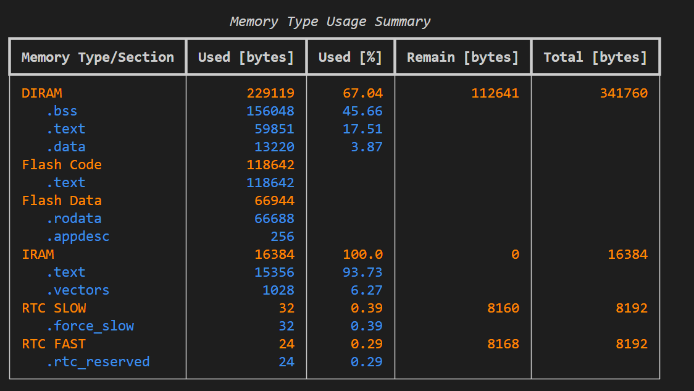
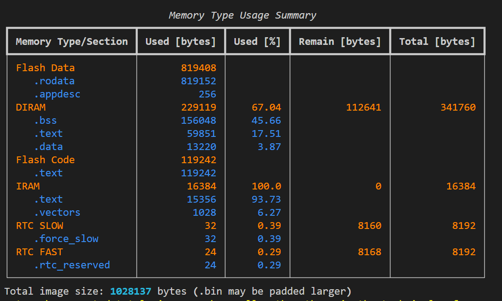

# 15_chinese_3k

> 精简版中文字库 — 3502 个常用汉字，节省 ~700KB Flash 空间

ESP32-S3 SPI LCD 汉字显示示例，使用精简版 3502 汉字字库（vs 完整版 20902 字）。

## 功能描述

- 驱动 SPI LCD 显示屏 (ILI9341-like, 240x320)
- 使用精简 16x16 中文字库 (3502 常用汉字)
- 显示 ASCII 字符 (8x16)
- LED 状态指示

## 硬件配置

| 外设 | 引脚/地址 |
|---|---|
| SPI2 MOSI | GPIO11 |
| SPI2 CLK | GPIO12 |
| SPI2 MISO | GPIO13 |
| LCD WR | GPIO40 |
| LCD CS | GPIO21 |
| I2C0 SDA | GPIO41 |
| I2C0 SCL | GPIO42 |
| XL9555 I2C 地址 | 0x20 |
| LED | GPIO1 |
| SPI LCD 时钟 | 60 MHz |

## 项目结构

```
15_chinese_3k/
├── main/
│   └── main.c                    # 应用入口，初始化后显示中英文
├── components/
│   └── BSP/
│       ├── SPI/                  # SPI2 总线驱动
│       ├── LCD/                  # LCD 驱动 (含TextBox自动换行)
│       ├── CHINESE16_3K/         # 精简中文字库 (3502字, 16x16点阵)
│       ├── IIC/                  # I2C 主机驱动
│       ├── XL9555/               # IO 扩展芯片驱动
│       └── LED/                  # LED 驱动
├── partitions-16MiB.csv          # 16MB Flash 分区表
├── all-chinese.png               # 全字库效果截图
├── no-all-chinese.png            # 无语字库效果截图
├── CLAUDE.md                     # Claude Code 项目指南
└── sdkconfig                     # ESP-IDF 配置
```

## Flash 占用对比

| 字库 | 字数 | .rodata 增量 | 镜像大小 |
|---|---|---|---|
| 无中文字库 | 0 | 基线 | ~269 KB |
| 完整 GB2312 | 20902 | +752 KB | ~1.0 MB |
| 精简 3K (本工程) | 3502 | ~112 KB | ~381 KB |




## 核心 API

```c
// 显示中文字符串（回调式像素绘制）
show_chinese_string(x, y, str, color, bg_color, lcd_draw_pixel, draw_ascii_callback);

// 显示 ASCII 字符串
lcd_show_string(x, y, width, height, font_size, str, color);
```

## 构建与烧录

```bash
idf.py build
idf.py flash monitor
```

## 生成字库

```bash
cd ../code_diff
uv run scripts/generate_chinese_3k.py
```
