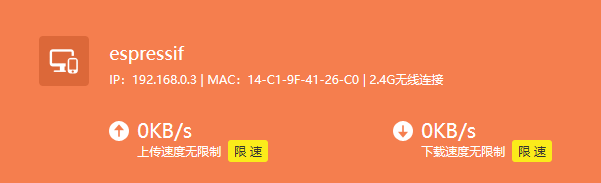
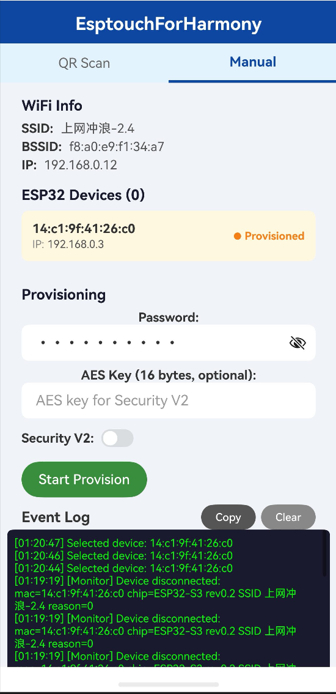
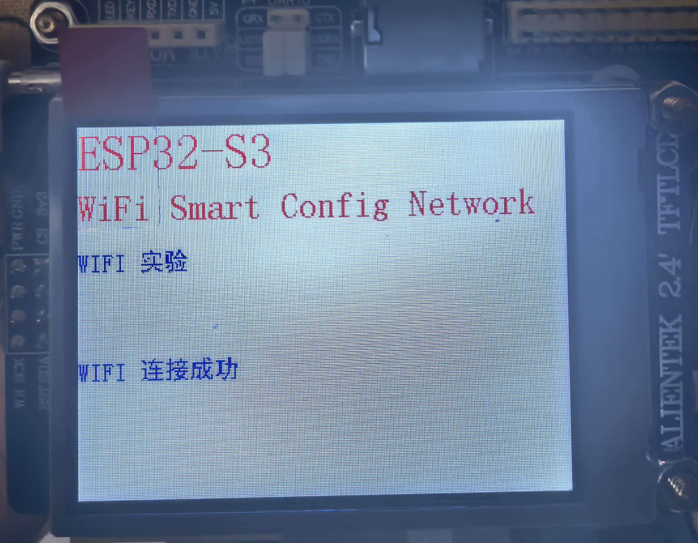

# 19_wifi_auto_esptouch

> ESP32-S3 作为 WiFi 热点 (AP)，创建名为 `esp32-s3-wifi` 的 WiFi，并显示连接设备信息

**1. 家庭 Wifi 中看到 `espressif`**：



**2. APP 配网**：


**3. 成功配网**：


## 功能

- ESP32-S3 作为 WiFi Access Point (热点)
- SSID: `esp32-s3-wifi`，密码: `123456789`
- 最多支持 5 个 STA 设备连接
- LCD 屏幕显示连接状态和设备 MAC 地址
- 有设备连接 / 断开时实时更新 LCD 显示

## AP 配置

```c
.ap = {
    .ssid           = "esp32-s3-wifi",
    .ssid_len       = strlen("esp32-s3-wifi"),
    .password       = "123456789",
    .max_connection = 5,
    .authmode       = WIFI_AUTH_WPA_WPA2_PSK,
}
```

## 日志输出

```shell
I (3996) AP: setup AP with IP:192.168.4.1
I (3996) AP: wifi_init_ap finished, ssid:'esp32-s3-wifi' | password: '123456789'
I (5123) AP: station "xx:xx:xx:xx:xx:xx" join, AID=1
I (6123) AP: station "xx:xx:xx:xx:xx:xx" leave, AID=1
```

## 使用的 API

### esp_wifi.h

| 函数                               | 说明                          |
|------------------------------------|-------------------------------|
| `esp_netif_init`                   | 网卡初始化                    |
| `esp_netif_create_default_wifi_ap` | 创建默认 AP 网卡              |
| `esp_wifi_init`                    | WiFi 初始化                   |
| `esp_wifi_set_mode`                | 设置 WiFi 模式 (WIFI_MODE_AP) |
| `esp_wifi_set_config`              | 设置 AP 配置                  |
| `esp_wifi_start`                   | 启动 WiFi                     |

### esp_event.h

| 函数                            | 说明             |
|---------------------------------|------------------|
| `esp_event_loop_create_default` | 创建默认事件循环 |
| `esp_event_handler_register`    | 注册事件处理函数 |

### esp_netif.h

| 函数                              | 说明         |
|-----------------------------------|--------------|
| `esp_netif_get_ip_info`           | 获取 IP 信息 |
| `esp_netif_get_handle_from_ifkey` | 获取网卡句柄 |

### 其他

| 函数          | 所属头文件       | 说明            |
|---------------|------------------|-----------------|
| `printf`      | `<stdio.h>`      | 打印输出        |
| `sprintf`     | `<stdio.h>`      | 格式化字符串    |
| `ESP_LOGI`    | `esp_log.h`      | 日志输出        |
| `memset`      | `<string.h>`     | 内存设置        |
| `inet_ntoa_r` | `lwip/sockets.h` | IP 地址转字符串 |

## esp32 设备与 EspTouchForHarmony 的关系

```shell

        +----------+     (已连接)    +-------------+
        |  手机    | ◄───WiFi────►  | TP-Link 路由器 |
        +----------+                | (你的WiFi网络) |
            |                      +-------------+
            | UDP广播                      │
            | (ESPTouch协议加密)             │
            | 数据编码在包长度中               │
            ▼                               ▼
        +----------+                  连接成功后
        | ESP32    | ───────────────► 也接入 TP-Link
        | (混杂模式)|   获得SSID+密码
        +----------+
```

  整个过程：

  1. 手机已连上 TP-Link 的 WiFi
  2. ESP32 没连任何 WiFi，只打开射频"监听"空中的无线信号
  3. 手机用 ESPTouch 协议把 SSID + WiFi密码 + BSSID 编码进 UDP 广播包的长度中，发出去
  4. ESP32 抓到这些空中无线帧，解析出 SSID 和密码
  5. ESP32 拿着这些凭据，像普通设备一样去连接 TP-Link 路由器
